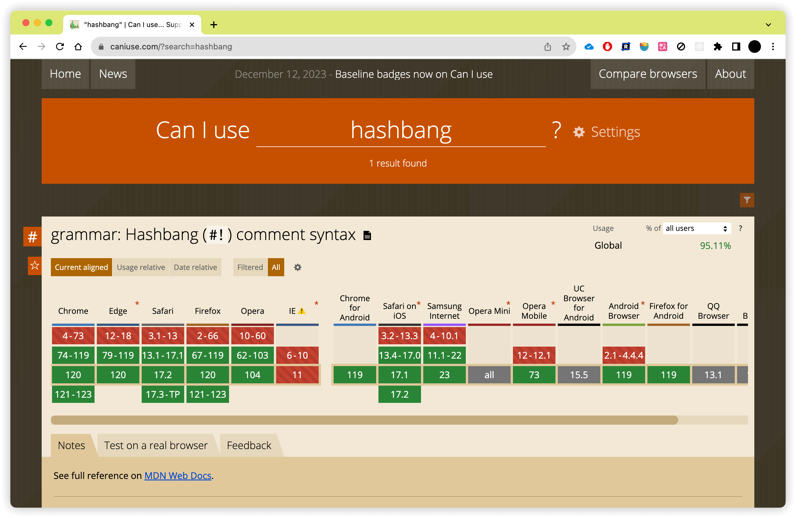

把一段 Shell 脚本保存成文本文件:

```sh
# hello.sh
echo 'Hello World'
```

我们可以通过两种方式运行, 第一种是 Shell 命令加脚本文件:

```sh
sh hello.sh
bash hello.sh
zsh hello.sh
```

第二种是赋予脚本文件可执行权限直接执行:

```sh
chmod +x hello.sh
./hello.sh
```

对于 JS 脚本文件, 我们通常是通过命令加脚本文件的方式:

```js
// index.js
console.log('Hello World');
```

```sh
node index.js
```

如果赋予 JS 脚本可执行权限直接运行会提示错误:

```sh
chmod +x index.js
./index.js
# ./index.js: line 1: syntax error near unexpected token `"Hello World"'
# ./index.js: line 1: `console.log("Hello World");'
```

这是因为直接执行脚本文件默认调用的是当前 Shell, 而 JS 不是合法的 Shell 语法. 不过在类 Unix 系统中, 存在一种称为 Shebang 的语法, 在脚本文件开头以 `#!` 开头加上解释器指令, 当前脚本将会以指定的解释器执行, 例如下面的例子, 将会调用 `zsh` 执行, 当然也可以修改成其他的 Shell 程序, 比如 `#!/bin/sh`/`#!/bin/bash`.

> Shebang 由 Sharp 和 Bang 两部分组成, `#` 常常被称为 Sharp, 比如微软推出的编程语言 `C#` 读作 `C Sharp`, 而 `!` 被称为 Bang. 此外 Shebang 也被称为 Hashbang, 因为 `#` 也被称为 Hash.

```sh
#!/bin/zsh
echo 'Hello World'
```

所以对于上面的 JS 脚本, 我们可以添加 Shebang 指定 node 运行:

```js
#!/usr/bin/node
console.log('Hello World');
```

每个人的环境都不一样, 如果 node 不位于 `/usr/bin/node` 怎么办? 一般来说有两种方法, 第一是通过 `where` 查找 node 所在的位置:

```sh
where node
# /opt/homebrew/bin/node
```

另一种方法是通过 `env`, `env` 能够帮我们找到正确的解释器:

```js
#!/usr/bin/env node
console.log('Hello World');
```

Shebang 能够在 Shell 中正常地发挥作用, 是因为 `#` 是 Shell 脚本中的注释语法, 解释器会忽略 Shebang 从而正常执行. 但是 `#` 在 JS 中不是合法的注释, 所以 node 或者 deno 这些 JS 运行时需要特殊处理从而达到兼容 Shebang 的目的.

不同于 node 或者 deno 的特殊处理, 浏览器中的 JS 引擎并不会识别到 Shebang, 如果一个 JS 脚本带有 Shebang 会被浏览器认为是语法错误. 为了解决这个问题, ECMAScript 2023 中正式通过了 [Hashbang 提案](https://github.com/tc39/proposal-hashbang).

为什么称为 `Hashbang` 而不是 `Shebang`, 主要是因为 JS 中 `#` 通常称为 `Hash` 而不是 `Sharp`.

目前基本所有的浏览器都支持了 Hashbang, 对于服务端和客户端同构的 JS 脚本我们不需要再关心 Hashbang 的问题.


