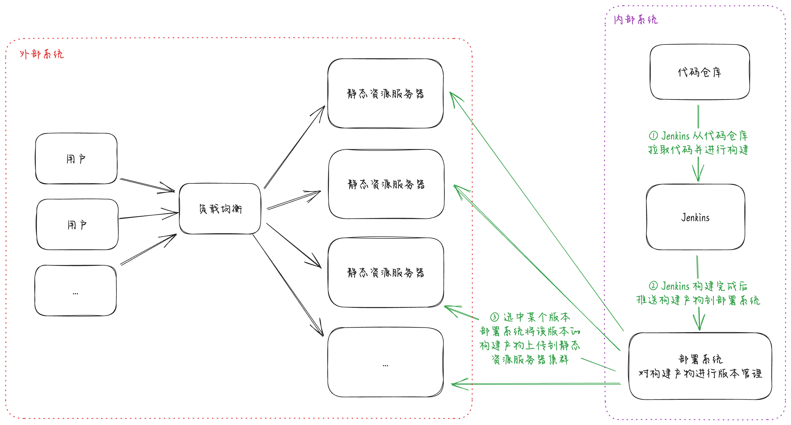
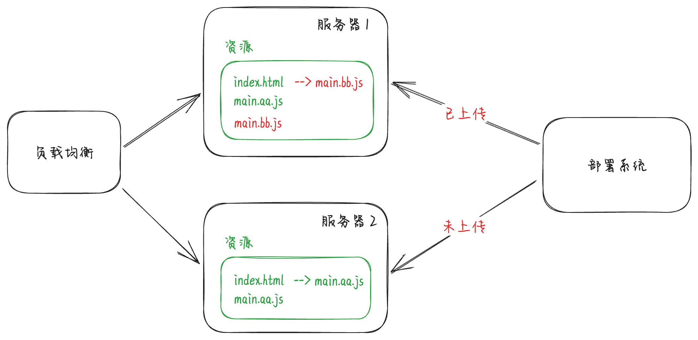
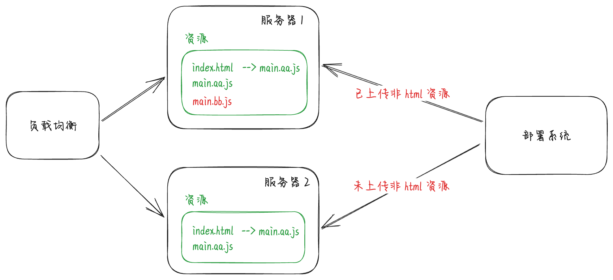
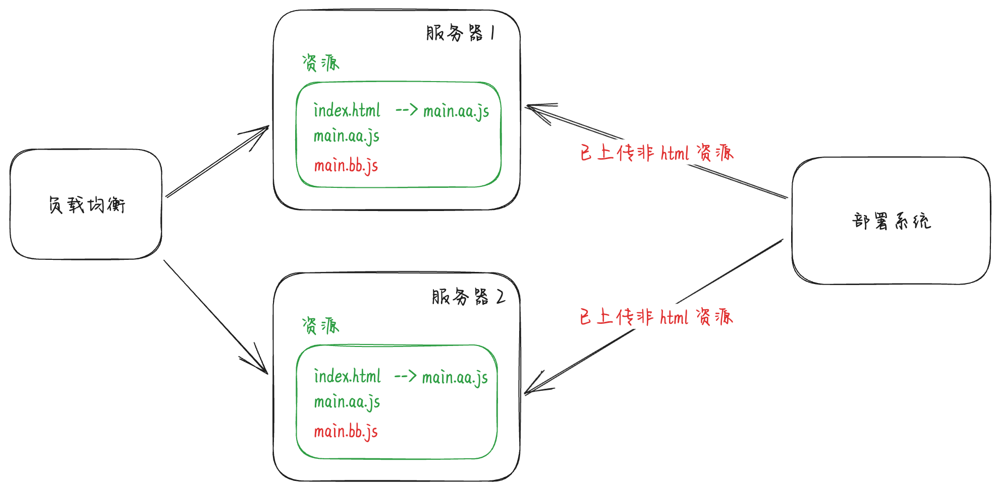
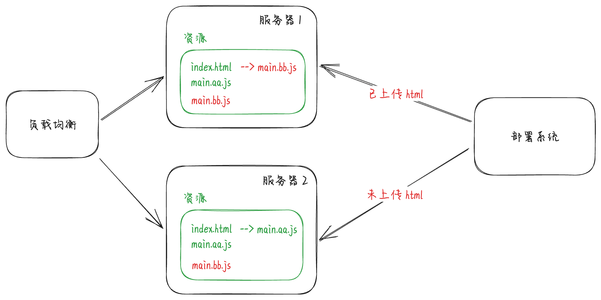

我们的一些前端页面偶尔会有用户反馈页面空白, 稍等一会刷新就正常了.
奇怪的是我们在日志系统并没有发现可能导致页面空白的报错, 所以我们一度以为是用户的网络问题.

直到有一次我们内部人员也遇到了这个问题, 我们马上封锁现场进行排查, 结果发现是某个 JS 文件 `404`, 导致页面初始化失败从而页面空白.
这也解释了为什么日志系统没有相关日志, 因为初始化失败导致了日志库并未被加载.

因为前端资源是由负载均衡后的多台服务器提供的, 所以我们马上登录到服务器一台一台地进行检查, 结果发现每台机器都存在该 JS 文件, 我们刷新空白页面后发现该 JS 文件请求也不再 `404`, 页面恢复正常.

毫无头绪下, 我们对前端项目的服务架构以及发版流程进行了整理, 示意图如下:



和运维一起进行多次排查后终于发现了问题所在, 问题出在第三步部署系统上传构建产物到静态资源服务器集群.

我们前端项目使用 Webpack 进行构建, 构建产物简化一下可以这样表示:

```
|- index.html(script --> main.[contenthash].js)
|- main.[contenthash].js
```

`[contenthash]` 表示文件内容的哈希值, 内容发生变化哈希值也会发生变化, `index.html` 中有个 `script` 标签指向 `main.[contenthash].js`, 同样地我们简化一下服务器集群为两台:


首先, 部署系统是覆盖上传资源的, 也就是说现有资源是不会被删除的, 只有遇到同名资源才会覆盖.
其次, 上传资源是逐台服务器进行的, 也就是上面的 `服务器1` 上传完成后再到 `服务器2`.

假设我们现在要发布新的版本, 构建产物为:

```
|- index.html(script --> main.bb.js)
|- main.bb.js
```

上一个版本的构建产物为:

```
|- index.html(script --> main.aa.js)
|- main.aa.js
```

因为部署系统是逐台服务器上传的, 所以必定存在 `服务器1` 已上传完成而 `服务器2` 未上传的过渡状态:



当处于这种状态下, 用户访问就存在以下情况:

1. 用户访问页面, 由负载均衡分配 `服务器1` 返回 `index.html`, 此时 html 中的 script 指向 `main.bb.js`
2. 浏览器解析 html, 发起 `main.bb.js` 请求
3. `main.bb.js` 请求由负载均衡分配 `服务器2` 返回, 此时 `服务器2` 不存在资源 `main.bb.js`, 响应 `404`

这就是造成页面空白的原因.

---

找到问题所在后, 我们也提出了一些解决方案, 比如部分停止服务进行更新:

1. 将一半的机器停止服务
2. 对停止服务这一半的机器进行更新
3. 更新完毕后重新启动服务, 同时停止另一半机器的服务
4. 对这剩下的一半机器进行更新, 更新完毕后重启服务

这个方案被否决了, 因为第三步存在两种情况:

1. 更新完的一半服务还没有启动, 另一半已经停止服务了, 会存在一段时间完全没有服务
2. 更新完的一半服务已经启动, 另一半还没有停止服务, 依然会出现上面 `404` 的情况

我们再归纳一下 `404` 出现的原因, 因为资源 `main.bb.js` 还未上传就已经存在资源的入口 `index.html --> main.bb.js`, 如果等资源上传完成后再有入口就不会这样的问题了, 所以我们的解决方案是这样的:

1. 部署系统将打包产物剔除所有的 `html` 文件, 然后逐台上传到服务器
2. 将剔除的 `html` 文件逐台上传到服务器

从上面的分析可知, 上传过程中存在过渡状态, 而 `404` 问题就出在过渡状态上, 而解决方案将一次上传分成了两次上传, 所以存在两个过渡状态, 以及第一步和第二步之间的过渡状态, 三个过渡状态我们逐个分析一下.



第一步的过渡状态中, 只是部分服务器多了一些没有被使用的资源文件, 没有负面影响.



和第一步的过渡状态一样, 第一步与第二步之间的过渡状态也是服务器多了一些未被使用的资源文件, 不会产生负面影响.



在第二步的过渡状态中, 会存在两个版本的 `html` 文件, 一个指向新版的资源, 一个指向旧版的资源, 但无论指向新版还是旧版, 所有服务器都存在相应的资源, 不会存在 `404` 问题.
